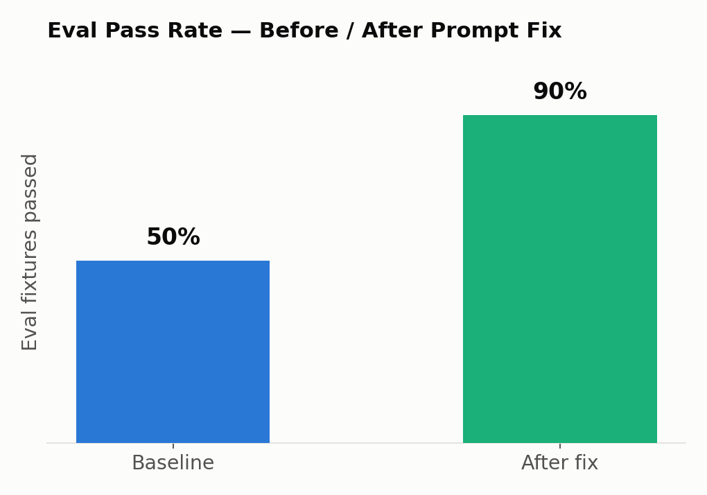
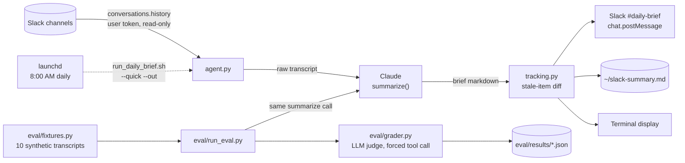
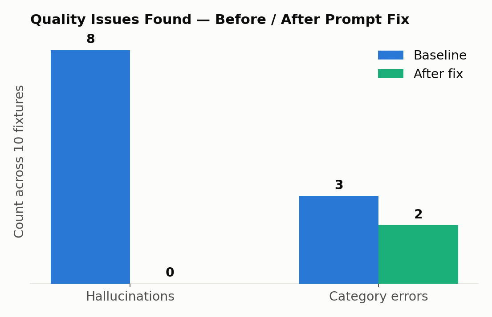

# Slack Daily Brief Agent

<div align="center">

[](https://www.python.org/)
[](https://www.anthropic.com/)
[](https://api.slack.com/)
[](eval/)

</div>

An LLM agent that turns a day's worth of Slack noise into a structured brief
— decisions, action items, blockers, open questions — with an eval harness
that caught (and proved the fix for) a real hallucination bug, day-over-day
stale-item tracking so nothing quietly repeats forever, and fully unattended
daily scheduling.

**Why this exists:** built to get real, hands-on practice with the parts of
shipping an LLM feature that don't show up in a demo — evals, prompt
regressions, and the gap between "the output looks right" and "the output
*is* right." Every claim in this README is backed by a script or a saved
report in this repo, not a slide — the eval reports in `eval/results/` are
the actual raw data behind the numbers below, not an example of what they
could look like.

## At a glance

| | |
|---|---|
| **Problem** | Manually skimming Slack every morning for decisions, blockers, and asks buried in channel noise |
| **Approach** | Claude-summarized daily brief, hardened against hallucination with a rubric-graded eval harness, tracked day-over-day so nothing silently repeats forever |
| **Result** | Eval pass rate **50% → 90%**, hallucinations **8 → 0** across the suite, verified against raw saved reports (below) |
| **Stack** | Python · Claude (Anthropic API) · Slack API · `difflib` for deterministic matching · `launchd` for scheduling |



## Architecture



## What's built here

| Piece | What it does |
|---|---|
| [`agent.py`](agent.py) | Reads Slack, calls Claude, renders the brief, posts back to Slack |
| [`eval/`](eval/) | 10-fixture rubric-graded eval harness with an LLM judge — [details & real numbers below](#eval-harness) |
| [`tracking.py`](tracking.py) | Day-over-day stale-item detection via `difflib` — no repeated open question goes unnoticed |
| [`run_daily_brief.sh`](run_daily_brief.sh) + [`com.example.slack-daily-brief.plist`](com.example.slack-daily-brief.plist) | Fully unattended daily scheduling via `launchd`, verified with no TTY attached |
| [`config.yaml`](config.yaml) | Channels, thresholds, Slack-posting target — all runtime behavior in one file |

## Key engineering decisions

| Decision | Why |
|---|---|
| `difflib` instead of an LLM call for stale-item matching | Day-to-day wording of the same lingering question is usually similar enough for deterministic string matching — free, debuggable, no added latency. Documented limitation and upgrade path in [`tracking.py`](tracking.py). |
| Forced tool-call (schema) for the eval judge | Structured grading output you can aggregate, not prose you have to parse — see [`eval/grader.py`](eval/grader.py) |
| Least-privilege Slack scopes, added incrementally | Started with 5 read-only scopes; added `chat:write` only once posting-back was actually needed — never requested more access than the current feature required |
| `--quick --out` for unattended runs | Eliminates every interactive prompt (channel picker, save confirm) — verified by running with `< /dev/null`, not assumed |
| Type-checked judge output instead of trusting "it's iterable" | A judge response once returned a JSON string instead of an array; iterating it silently produced 209 garbage entries. Fixed with an explicit `isinstance` check — [full writeup below](#the-eval-harness-itself-had-a-bug) |

---

## Output example

```
# 📋 Slack Daily Brief — Wednesday, August 20, 2026

## 🔑 Key Decisions
- Agreed to delay the Q3 infra migration by two weeks to accommodate the compliance audit
- #product: Launch date for v2.1 moved to Sep 15

## ✅ Action Items
- [ ] **@navis**: Send updated migration timeline to stakeholders by EOD
- [ ] **@priya**: Triage the 3 open P1 bugs before Thursday's release
- [ ] **@eng-leads**: Review the new oncall rotation proposal and vote by Friday

## 🚨 Blockers & Urgencies
- Data pipeline is failing for 3 customers — @deepak is investigating but needs access to prod logs

## 📣 Announcements & FYIs
- All-hands moved to Thursday 10 AM PT
- New security policy requires 2FA on all service accounts by Sep 1

## ❓ Open Questions
- #engineering: Who owns the auth service after the reorg? Not yet answered.
```

---

## Setup

### Step 1 — Get a Slack User Token

Self-install a Slack App on any workspace you're a member of — a personal
workspace works fine and needs no admin approval:

1. Go to [api.slack.com/apps](https://api.slack.com/apps) → **Create New App** → **From scratch**
2. Pick your workspace
3. **OAuth & Permissions** → **Scopes** → **User Token Scopes** → add the scopes below
4. **Install to Workspace** → Allow
5. Copy the **User OAuth Token** (starts with `xoxp-`)

Required scopes:

| Scope | Why |
|---|---|
| `channels:history` | Read public channel messages |
| `channels:read` | List and look up public channels by name |
| `groups:history` | Read private channel messages |
| `groups:read` | List and look up private channels by name |
| `users:read` | Resolve user IDs to display names |

### Step 2 — Get an Anthropic API key

1. Go to [https://console.anthropic.com/](https://console.anthropic.com/)
2. Create an API key
3. Copy it

### Step 3 — Install

```bash
cd slack-daily-agent
python3 -m venv venv
source venv/bin/activate
pip install -r requirements.txt
```

### Step 4 — Configure

```bash
cp .env.example .env
# Edit .env with your tokens:
#   SLACK_USER_TOKEN=xoxp-...
#   ANTHROPIC_API_KEY=sk-ant-...
```

Then edit `config.yaml` to set which channels you want to monitor:

```yaml
channels:
  - general
  - engineering
  - product
  - your-team-channel
```

---

## Usage

```bash
# Activate the virtualenv first
source venv/bin/activate

# Run with defaults (reads last 24h, writes ~/slack-summary.md)
python agent.py

# Look back only 8 hours
python agent.py --hours 8

# Override channels from the command line
python agent.py --channels engineering product infra

# Print only — no file written
python agent.py --no-file

# Write to a specific file
python agent.py --out /tmp/today.md
```

The summary is printed to your terminal **and** saved to `~/slack-summary.md` (configurable in `config.yaml`).

---

## Tips

- **First run:** Start with `--no-file --hours 4` to test it's working before committing to a 24h window.
- **Private channels:** The User token will include private channels you're a member of automatically.
- **Large workspaces:** If you have many channels with high traffic, add a tight `channels:` list in `config.yaml` to keep API calls and Claude costs low.
- **Cost:** A typical 24h summary across 5 active channels costs < $0.10 with `claude-sonnet-5`.
- **Data handling:** The agent only reads recent history at run time and stores nothing beyond the local summary file you choose to save.

---

## Posting back to Slack

Set `slack_post_channel` in `config.yaml` to a channel name (a private
channel works fine, and is what this is designed for — your own working
notes, not a broadcast) and the generated brief posts there automatically
after each run, via your own user token, using the `chat:write` scope. Leave
it blank to skip posting entirely.

## Running it automatically every morning (macOS)

`run_daily_brief.sh` wraps the agent for unattended execution — `--quick`
skips the interactive channel picker and `--out` skips the "save?" confirm
prompt, so there's zero interactivity to hang on with no TTY attached
(verified by running it with `< /dev/null`, same as cron/launchd would).

1. Copy the template and fill in your absolute path:
   ```bash
   cp com.example.slack-daily-brief.plist ~/Library/LaunchAgents/com.<you>.slack-daily-brief.plist
   # edit it: replace /absolute/path/to/slack-daily-agent with your actual path
   ```
2. Load it:
   ```bash
   launchctl load -w ~/Library/LaunchAgents/com.<you>.slack-daily-brief.plist
   ```
3. Check it's registered: `launchctl list | grep slack-daily-brief`

It only runs while you're logged in (standard LaunchAgent limitation — fine
for a laptop you use daily). To change the time, edit the `Hour`/`Minute`
values and reload. To disable: `launchctl unload ~/Library/LaunchAgents/com.<you>.slack-daily-brief.plist`.

Logs land in `logs/launchd.out.log` / `logs/launchd.err.log` (gitignored).

---

## Stale item tracking

Without this, an unanswered question shows up in the brief identically every
single day forever. [tracking.py](tracking.py) fixes that: it pulls the
bullets out of the Open Questions section, fuzzy-matches them (via
`difflib`, deliberately no extra LLM call — see the module docstring for the
tradeoff) against still-open items from previous runs, and flags anything
that's lingered past `stale_after_days` (default 2) directly in the
markdown:

```
- Still no word on the analytics vendor decision — [#got-a-sec]  🔴 *(open 3 days running)*
```

State lives in `history/open_items.json` (gitignored — it's your personal
runtime data, not something to commit). An item that stops appearing in the
brief is assumed resolved and dropped from history automatically.

---

## Eval harness

Prompt changes to an LLM summarizer are easy to break silently — a tweak that
fixes one case can quietly regress another. `eval/` is a small harness that
catches that: it runs the agent's real `summarize()` against a fixed set of
synthetic Slack transcripts ([eval/fixtures.py](eval/fixtures.py)) and grades
each output with an LLM judge against a rubric ([eval/grader.py](eval/grader.py)).

Each fixture targets a specific failure mode real summarizers hit in
production: inferring an action-item owner from context, merging a duplicate
topic mentioned in two channels into one decision, *not* surfacing a question
that got answered later in the same thread, telling a genuine decision apart
from a proposal phrased as a question, filtering standup-bot noise, and still
listing a quiet channel in Channel Summaries.

The judge grades on three axes:
- **Recall** — did every expected fact make it into the summary?
- **Precision** — did the summary invent anything not supported by the
  transcript (a hallucinated owner, date, or decision)?
- **Category placement** — did a question get written up as a firm decision,
  or an FYI get turned into an action item?

```bash
# Run the full suite against the default model
python eval/run_eval.py

# Test a different model
python eval/run_eval.py --model claude-opus-5

# Save a timestamped report for later comparison
python eval/run_eval.py --save

# Diff this run against a saved report — catches prompt regressions
python eval/run_eval.py --compare eval/results/run_2026-08-20T10-00-00.json
```

Exits non-zero if the pass rate drops below `--threshold` (default 100%), so
this can gate CI on prompt/system-prompt changes.

### A real finding from this harness

First run against the live system prompt: **5/10 fixtures failed, pass rate 50%.**
The judge flagged a consistent pattern — the agent was inventing action-item
owners and tasks that were never stated ("Action item: @priya to coordinate
with engineering..." when the transcript only recorded a decision, no task or
owner), and adding its own severity framing ("launch timeline is at risk")
not present in the source messages. The system prompt's "Always try to name
action item owners" rule was actively rewarding this.

Tightened the prompt to require every claim be grounded in the transcript —
owners can be *inferred* from context, but tasks, owners, and severity can't
be *invented* — and reran:

```bash
python eval/run_eval.py --save --compare eval/results/run_<baseline>.json
```

| Metric | Baseline | After fix |
|---|---|---|
| Pass rate | 50% (5/10) | 90% (9/10) |
| Recall (expected facts surfaced) | 90% | 100% |
| Hallucinations | 8 | 0 |
| Category errors | 3 | 2 |




The sharper insight the corrected numbers surface: baseline recall was
already 90% — the agent wasn't *missing* information. The actual failure
mode was precision: it kept *adding* things that weren't there (invented
owners, invented tasks, invented severity). That's a meaningfully different
bug to be chasing than "the model missed something," and the eval harness
is what made that distinction visible instead of guessing from a few
spot-checked outputs.

The one remaining failure after the fix is a judgment call, not a
hallucination: a Q&A exchange resolved inside a thread gets written up as a
"Key Decision" rather than being left out — arguably reasonable content,
just filed under the wrong header. Saved reports for both runs are in
`eval/results/` for the exact diff.

### The eval harness itself had a bug

Worth being honest about, since it's as good a lesson as the finding above:
while preparing these numbers for writeup, one judge response came back with
`matched_expected` as a JSON-encoded *string* instead of an array. Python
happily iterates a string character-by-character with no error — the code
did exactly that, turning one grading call into 209 garbage one-character
"facts," which silently cratered the recall stat to ~5% with nothing
indicating why. `pass_rate` (a plain string field, not iterated) was
unaffected and stayed correct throughout.

Fixed by (1) explicitly checking `isinstance(items, list)` before iterating
any nested judge output — "it's iterable" is not the same guarantee as "it's
the array I asked for" — and (2) computing the recall denominator from each
fixture's ground-truth expected-fact count instead of trusting the judge's
returned array length, so one degenerate call can't silently skew the whole
run's aggregate. See [eval/run_eval.py](eval/run_eval.py)'s `_normalize_grade`
and recall calculation for the fix. Numbers above are post-fix and verified
against the raw per-fixture grades in `eval/results/`.

This is the harness doing its actual job twice over: catching a real,
non-obvious quality regression in the agent that spot-checking would have
missed, and then catching a bug in its own metrics before those numbers went
anywhere public.

---

## Troubleshooting

| Error | Fix |
|---|---|
| `not_in_channel` | The token's user isn't a member of that channel |
| `missing_scope` | Add the required scope in the Slack App settings and reinstall |
| `ratelimited` | The script already has delays; wait a minute and retry |
| Channels show `not found` | Check spelling in `config.yaml`; channel names are case-insensitive |
