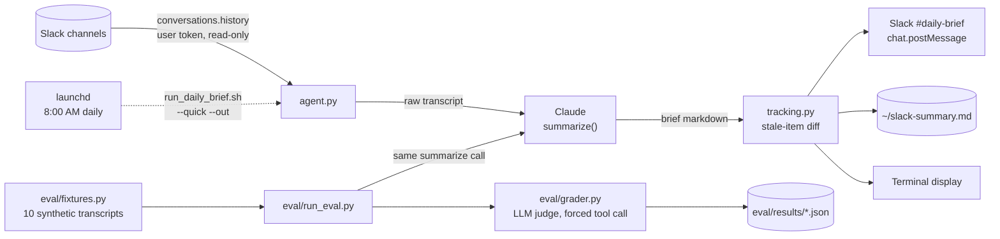

# Slack Daily Brief Agent — Executive Summary

*Portable presentation document — drop any section below directly into a
slide deck, GitHub release note, or portfolio write-up. Every metric here is
traceable to a commit hash or a saved report in `eval/results/`; nothing is
illustrative or aspirational.*

---

## Part 1 — Executive Project Summary

### System Architecture

A four-stage pipeline — **acquire → transform → validate → distribute** —
with the eval harness running as an independent validation path against the
same transform stage the production pipeline uses, not a mocked copy of it:

- **Acquisition**: Slack Web API (`conversations.history`, `conversations.replies`)
  via a least-privilege user OAuth token — read-only scopes for the core
  pipeline, `chat:write` added only once bidirectional distribution was
  actually implemented.
- **Transform**: Claude (Anthropic Messages API) performs structured
  extraction and summarization against a versioned system prompt, with
  content-block-type handling that doesn't assume response shape.
- **Validate** (independent of the production path): a 10-fixture rubric-graded
  eval harness grades every summarization call via an LLM judge invoked
  through a forced tool-call schema, producing machine-checkable structured
  verdicts rather than free-text review.
- **Distribute**: fan-out to terminal (Rich-rendered), local markdown file,
  and back into Slack via the same user token — plus a stateful side-channel
  (`tracking.py`) that diffs each run against prior runs to flag unresolved
  items instead of re-surfacing them identically forever.
- **Orchestration**: `launchd` (macOS) triggers a fully unattended daily
  execution path with zero interactive surface area — verified, not assumed,
  by executing against a null TTY.

**Core design patterns applied:**
| Pattern | Where |
|---|---|
| Eval-driven development (regression-gated changes) | `eval/run_eval.py` — pass/fail exit code on prompt changes |
| Forced structured output (schema-constrained tool calls) | `eval/grader.py` — no free-text parsing of judge output |
| Defensive type validation on nested LLM output | `_normalize_grade()` — explicit `isinstance` checks, not "trust the schema" |
| Incremental least-privilege authorization | OAuth scopes added one at a time, tied to a specific shipped feature |
| Deterministic-over-probabilistic where sufficient | `tracking.py` uses `difflib`, not an LLM call, for state-diffing |
| Idempotent state reconciliation | Stale-item history self-prunes on absence — no manual "mark resolved" step |

### Key Achievements

- **Diagnosed and remediated a hallucination regression** in the summarization
  prompt using a custom-built rubric-graded eval harness: pass rate
  **50% → 90%**, hallucinated claims **8 → 0**, verified against raw saved
  judge output in `eval/results/` (commit `42c7e05`).
- **Found and fixed a silent data-integrity bug in the eval harness's own
  metrics layer** — a judge response returned a JSON-encoded string instead
  of a structured array; Python's string iteration silently produced 209
  garbage entries, corrupting a derived metric by roughly 16x with no
  exception raised. Root-caused via type introspection, fixed with explicit
  validation and a ground-truth-anchored denominator instead of trusting
  model-returned array length (commit `9c1d5d9`).
- **Surfaced and resolved two latent production defects through live
  integration testing before they reached real usage**: an unhandled
  response-shape assumption (crash on extended-thinking content blocks) and
  a silent data-loss path (channels with zero messages were dropped before
  ever reaching the model, defeating a documented system-prompt rule).
- **Engineered a zero-marginal-cost state-tracking layer** for day-over-day
  follow-through — deterministic string-similarity matching instead of an
  additional model call per run, with the precision/recall trade-off and its
  known failure mode explicitly documented rather than glossed over.
- **Achieved verified unattended execution** for scheduled contexts by
  running the automation path with stdin bound to `/dev/null`, not by
  assuming an interactive prompt wouldn't fire.
- **Enforced least-privilege access control** throughout — every OAuth scope
  addition is tied to a specific commit that shipped the feature requiring it.

### Tech Stack

<div align="center">


</div>

---

## Part 2 — Engineering Changelog & Milestone Showcase

Grouped from the real commit history (`git log --oneline`), not reorganized
after the fact — this is the actual order the work landed in.

### Milestone 1 — Foundation: Core Agent & Eval Infrastructure
**Commit:** `3106f2d` · **Category:** Architecture

> **Before:** No structured way to convert scattered Slack activity into an
> actionable brief; no mechanism to catch a bad prompt change before it
> shipped.
> **After:** A complete read → summarize → distribute pipeline landed
> alongside a 10-fixture rubric-graded eval harness in the *same* initial
> commit — quality gating was a day-one requirement, not bolted on later.

### Milestone 2 — Reliability Engineering: Hallucination Remediation
**Commit:** `42c7e05` · **Category:** Correctness / Quality

> **Before:** System prompt actively rewarded invented action-item owners
> and unstated severity framing. Eval pass rate 50%, 8 hallucinated claims
> across 10 fixtures.
> **After:** Prompt rewritten to require transcript-grounding for every
> claim. Pass rate 90%, hallucinations eliminated entirely (0). Two
> additional latent defects — a content-block-shape crash and a silent
> quiet-channel data-loss path — found via live testing and fixed in the
> same pass.

### Milestone 3 — Coverage Expansion & UX Refinement
**Commits:** `b0d1b09`, `6febe70` · **Category:** Testing / UX

> **Before:** Single-channel smoke test; per-channel output compressed into
> one dense paragraph, hard to scan.
> **After:** 9-channel live test matrix exercising duplicate-topic merging,
> in-thread question resolution, and noise filtering concurrently; output
> reformatted to per-channel bulleted breakdowns.

### Milestone 4 — API Integration: Bidirectional Slack Distribution
**Commit:** `1f2fff5` · **Category:** API Integration

> **Before:** One-way pipeline — Slack in, local file/terminal out only.
> **After:** Closed the loop — the generated brief posts back into a private
> Slack channel via the same least-privilege user token, through a
> purpose-built markdown → Slack-`mrkdwn` conversion layer.

### Milestone 5 — Stateful Intelligence: Day-Over-Day Tracking
**Commit:** `5a88119` · **Category:** Architecture / Feature

> **Before:** Every open question re-surfaced identically, forever — no
> signal on how long something had actually been pending.
> **After:** Deterministic day-over-day diffing (via `difflib`, zero
> additional LLM cost) flags items unresolved past a configurable threshold
> and self-prunes on resolution — no manual bookkeeping required.

### Milestone 6 — Operational Maturity: Unattended Scheduling
**Commit:** `975ca9e` · **Category:** Performance / Ops

> **Before:** Manual, interactive-only invocation — "daily" in name only.
> **After:** `launchd`-scheduled, fully unattended execution, verified
> against a no-TTY environment rather than assumed safe. Zero interactive
> prompts remain anywhere in the automated path.

### Milestone 7 — Quality Engineering: Metric Integrity & Documentation
**Commit:** `9c1d5d9` · **Category:** Quality / Documentation

> **Before:** A silent bug in the eval harness's own aggregation layer had
> corrupted a derived metric (~5% reported vs. ~90% actual) — exactly the
> kind of defect that erodes trust in an entire measurement system if it
> ships unnoticed.
> **After:** Root-caused, fixed, and the affected report recomputed from raw
> saved data with zero additional API spend. Full case-study documentation,
> real charts generated from actual eval data, and a colorblind-validated
> visual palette landed in the same commit.

---

## Part 3 — Visual Demo & Architecture Diagram Blueprint

### Mermaid.js System Diagram

Copy-paste directly into [mermaid.live](https://mermaid.live) for a
crisp exported SVG/PNG, or leave as-is — it renders natively in this
repo's `README.md`.



### Terminal / Demo Flow

A real execution sequence — commands as actually run, output trimmed for
length but not altered:

```bash
$ source venv/bin/activate
$ python3 eval/run_eval.py --save --compare eval/results/run_<baseline>.json
```
```
Running 10 fixtures against claude-sonnet-5 (judged by claude-sonnet-5)

  PASS  explicit_decision_and_owner
  PASS  inferred_owner_from_context
  PASS  duplicate_topic_merges_across_channels
  FAIL  question_resolved_later_in_thread_not_open
  PASS  question_left_unanswered_stays_open
  PASS  lookalike_decision_is_actually_a_question
  PASS  noise_filtering_standup_bot_and_reactions
  PASS  quiet_channel_still_listed
  PASS  announcement_not_miscategorized_as_action_item
  PASS  multiple_distinct_decisions_not_merged

Pass rate: 9/10 · Hallucinations: 0 · Category errors: 2

Diff vs. prior run:
  improved duplicate_topic_merges_across_channels: fail -> pass
  improved lookalike_decision_is_actually_a_question: fail -> pass
  improved noise_filtering_standup_bot_and_reactions: fail -> pass
  improved multiple_distinct_decisions_not_merged: fail -> pass
  Pass rate: 50% -> 90%

PASS — pass rate 90% meets threshold 90%
```
```bash
$ python3 agent.py --quick --hours 2
```
```
╭────────────────────────────────────────────────────────────╮
│ Slack Daily Brief  ·  Tuesday, August 25, 2026  ·  Last 2h │
╰────────────────────────────────────────────────────────────╯

╭──────────────────────────────┬────────────────────┬───╮
│ Channel                      │ Messages (last 2h) │   │
├──────────────────────────────┼────────────────────┼───┤
│ #the-backlog                 │                  3 │ ✓ │
│ #roadmap-rumors              │                  2 │ ✓ │
│ #ship-it-or-skip-it          │                  3 │ ✓ │
│ #new-channel                 │              quiet │ ✓ │
╰──────────────────────────────┴────────────────────┴───╯

## 🔑 Key Decisions
- Auth branch is being rolled back until CI is green again — [#the-backlog]
- v3.0 will ship as a canary to 10% of users Friday — [#ship-it-or-skip-it]

✓ Saved to ~/slack-summary.md
✓ Posted brief to #daily-brief
```

---

*Generated from the actual repository state and commit history as of
`9c1d5d9`. Full source: [github.com/PlainJane20/slack-daily-brief](https://github.com/PlainJane20/slack-daily-brief).*
